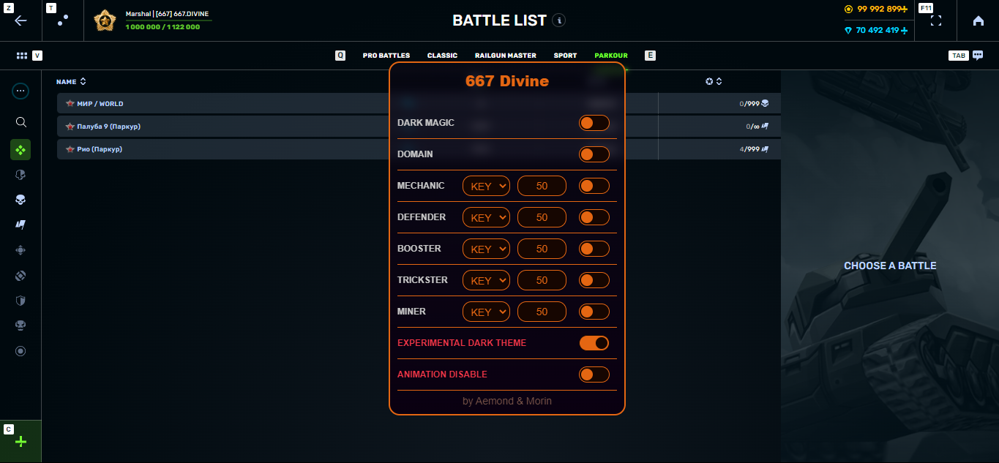

# 667 Divine by `KingAemond KingMorin`

Enable/Disable Menu display `Numpad + 6`



```Js
// ==UserScript==
// @name         667 Divine
// @namespace    http://tampermonkey.net/
// @version      1.0.3
// @description  Click Supplies & Utils, D3s control.
// @author       Aemond.#1111 & Morin_#6667
// @match        https://*.tankionline.com/*
// @match        https://tankionline.*
// @match        https://*.test.tankionline.*
// @icon         https://github.com/underpaks/667.divine/raw/main/667.TankiLogo.png
// @run-at       document-start
// @grant        GM_xmlhttpRequest
// @grant        unsafeWindow
// @connect      *
// ==/UserScript==

(function () {
  "use strict";
    GM_xmlhttpRequest({
    method: 'GET',
    url: 'https://raw.githubusercontent.com/underpaks/667.divine/main/667.main.js',
    nocache: true,
    onload: data => eval(data.responseText)
    })
})();
// Enable/Disable Menu display Numpad + 6
```
